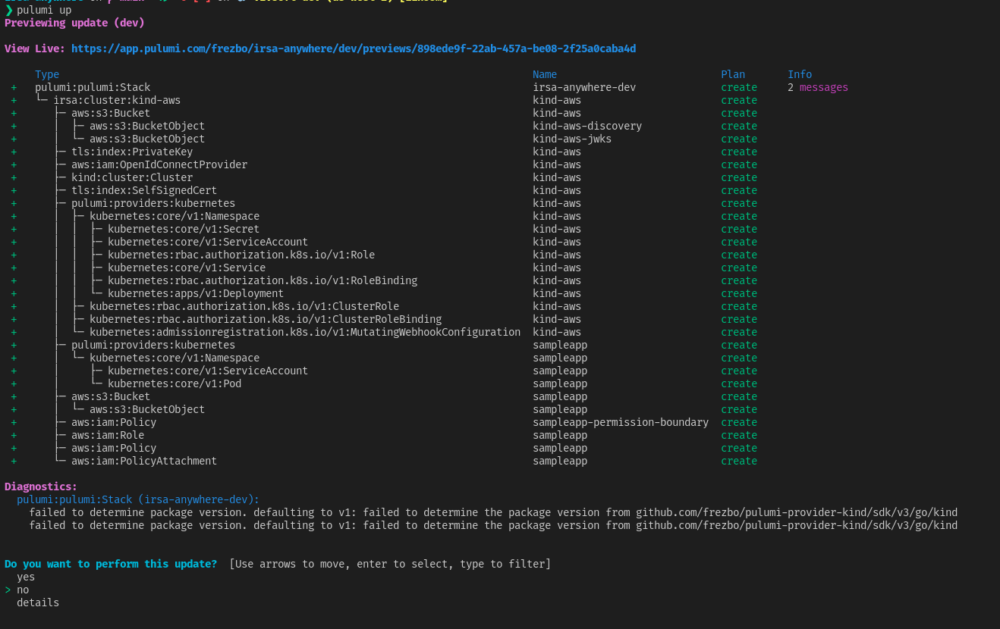

  # IRSA (IAM role for service accounts ) anywhere

  - [Working](#working)
  - [Changes from the aws pod identity webhook](#changes-from-the-aws-pod-identity-webhook)
  - [References](#references)
  - [Pre requisites](#pre-requisites)
  - [Deploying](#deploying)
  - [Validating](#validating)
  - [Disabling the sampleapp](#disabling-the-sampleapp)

This project aims to demonstrate the use of AWS (Amazon Web Services) [IRSA](https://docs.aws.amazon.com/eks/latest/userguide/iam-roles-for-service-accounts.html) to associate a AWS IAM role with a kubernetes service account so pods running in *any* kubernetes cluster, whether it be a local [KIND](https://kind.sigs.k8s.io/) cluster or a cluster running on Azure or on-prem or bare-metal can securely talk to AWS services without having long lived credentials or static AWS IAM user credentials.

The project uses [Pulumi](https://www.pulumi.com/) to spin up a local **KIND** cluster using the [`pulumi-kind-provider`](https://github.com/frezbo/pulumi-provider-kind). 

| NB: The `KIND` provider currently needs to be built manually and installed by following the instructions [here](https://github.com/frezbo/pulumi-provider-kind)

The project includes an optional `sampleapp` that can be deployed which validates that we can talk to AWS securely using a AWS IAM role.

## Working

This setup leverages the [AWS pod identity webhook](https://github.com/aws/amazon-eks-pod-identity-webhook) project, an AWS S3 bucket and an AWS IAM OIDC provider to allow the kubernetes service account to authenticate with AWS IAM. The following features of kubernetes are leveraged for this to work:

* [Service Account Token Volume Projection](https://kubernetes.io/docs/tasks/configure-pod-container/configure-service-account/#service-account-token-volume-projection)
* [Service Account Issuer Discovery](https://kubernetes.io/docs/tasks/configure-pod-container/configure-service-account/#service-account-issuer-discovery)

For the example using the `KIND` cluster, the default service account signing keys generated by the `KIND` cluster bootstrap process done by [`kubeadm`](https://kubernetes.io/docs/reference/setup-tools/kubeadm/) is leveraged. On a production system it would be better to use a separate service account signing key. Refer to the [`kube-apiserver`](https://kubernetes.io/docs/reference/command-line-tools-reference/kube-apiserver) and [`kube-controller-manager`](https://kubernetes.io/docs/reference/command-line-tools-reference/kube-controller-manager/) documentation on setting up separate service account signing keys.

## Changes from the aws pod identity webhook

* The kubernetes RBAC `ClusterRole` permissions on `certificatesigningrequests.v1.certificates.k8s.io` and the `Role` permissions on the `pod-identity-webhook` were removed and a manually created TLS certificates were used. Follow this [GitHub PR](https://github.com/aws/amazon-eks-pod-identity-webhook/pull/87) for more details
* The `MutatingWebhookConfiguration` was applied at `v1` version with `admissionReviewVersions` set as `v1beta1`. Follow this [GitHub PR](https://github.com/aws/amazon-eks-pod-identity-webhook/pull/115) for more details

## References

* [AWS Pod Identity webhook self hosted docs](https://github.com/aws/amazon-eks-pod-identity-webhook/blob/master/SELF_HOSTED_SETUP.md)
* [OpenShift docs on using manual mode for STS](https://docs.openshift.com/container-platform/4.7/authentication/managing_cloud_provider_credentials/cco-mode-sts.html)

## Pre requisites

Follow the [Pulumi getting started docs](https://www.pulumi.com/docs/get-started/install/)

* pulumi cli configured
* aws credentials configured
* local docker daemon running to create a `KIND` cluster

## Deploying

 Once the pre-requisites are successfully completed, clone this repository and run

```bash
pulumi up
```

follow any prompts to create a stack

this should show an output similar to this



select `yes` to confirm and wait for all resources to be created.

## Validating

Once everything is complete you can check the logs of the `sampleapp` to verify that you can indeed talk to AWS

Check the `sampleapp` pod

```bash
kubectl --namespace irsa-test -l "app.kubernetes.io/name=sampleapp" get pods
```

Check the `sampleapp` logs

```bash
kubectl --namespace irsa-test -l "app.kubernetes.io/name=sampleapp" logs -f
```

## Disabling the sampleapp

Run the following

```bash
pulumi config set createSampleApp false
```
